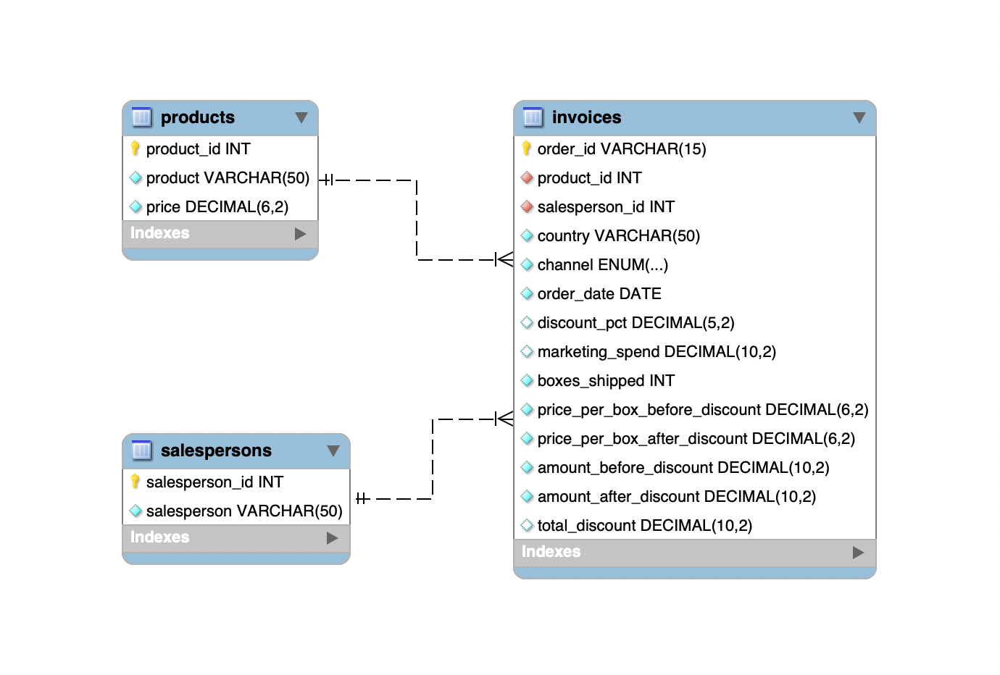

# Chocolate Sales SQL Database Project

This project uses a chocolate sales dataset to clean the data, organize it into tables, create a MySQL database, and run SQL analysis.

The project is based on the file `Chocolate_Sales.csv`.

The information comes from [Kaggle](https://www.kaggle.com/datasets/arjunmehta1992/chocolate-sales-in-20222023/data).

There is also a [PowerPoint presentation](https://docs.google.com/presentation/d/1vqP3iNr33XnmzKCvtx8ezJWh8Y4beNrO/edit?slide=id.p1#slide=id.p1) that explains the project and analysis further.

## Files

- `Chocolate_Sales.csv`: original dataset.
- `chocolate_clean.ipynb`: notebook used to clean the data.
- `cleaning_chocolate.py`: helper functions used by the cleaning notebook.
- `creating_chocolate_db.ipynb`: notebook used to create and load the MySQL database.
- `chocolate_queries.sql`: SQL queries used for the analysis.
- `chocolate_analysis_and_visuals.ipynb`: notebook with analysis and charts.
- `chocolate_db.jpg`: image of the database schema.
- `data/clean/products.csv`: cleaned products table.
- `data/clean/salespersons.csv`: cleaned salespersons table.
- `data/clean/invoices.csv`: cleaned invoices table.

## Data

The original dataset has 200,000 rows.

The cleaned data is saved in three CSV files:

- `products.csv`: 12 products.
- `salespersons.csv`: 25 salespersons.
- `invoices.csv`: 199,563 invoice rows.

During the cleaning process, we also reviewed the product prices. The prices in the original data seemed inaccurate, so we adjusted the product prices and recalculated the invoice amounts using the corrected prices.

We also found rows where `boxes_shipped` was negative. We kept those rows because they represent returns. Since the amounts are calculated from `boxes_shipped`, those return rows also have negative amounts.

Because of this, we had to adjust the SQL queries. For normal sales analysis, the queries filter out returns using `amount_after_discount >= 0` and `boxes_shipped >= 0`. For returns analysis, the SQL uses the negative values with `amount_after_discount < 0` and `boxes_shipped < 0`.

## Database Structure

The database has three tables:

- `products`
- `salespersons`
- `invoices`

The `invoices` table connects to `products` and `salespersons` using IDs.

The database schema is shown in `chocolate_db.png`.

## Main Workflow

1. Run `chocolate_clean.ipynb` to clean the original CSV.
2. The cleaned files are created inside `data/clean/`.
3. Run `creating_chocolate_db.ipynb` to create the MySQL database and load the cleaned tables.
4. Run the queries in `chocolate_queries.sql`.
5. Open `chocolate_analysis_and_visuals.ipynb` to see the analysis and charts.

## SQL Analysis

The SQL file includes queries about:

- sales by country
- returns by country
- products by boxes sold
- products by revenue
- channel performance
- monthly revenue
- top salespeople
- best product by country
- discounts and volume

## Notes

- The MySQL database name used in the project is `Chocolate_DB`.
- The cleaned tables should be loaded in this order: `products`, `salespersons`, then `invoices`.
- The PowerPoint presentation gives more context and explains the analysis in more detail.
